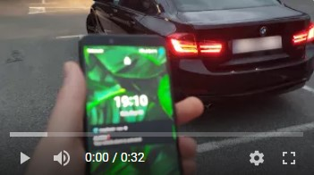
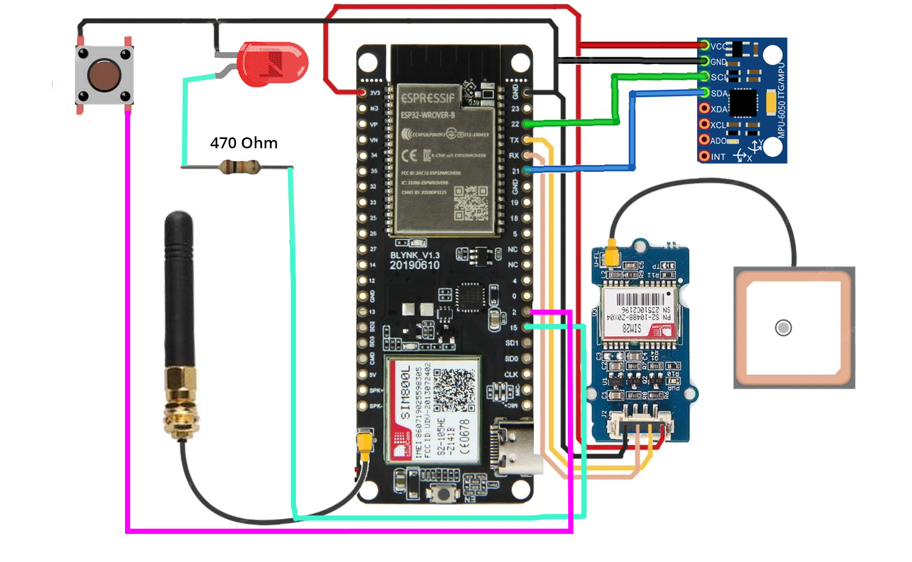
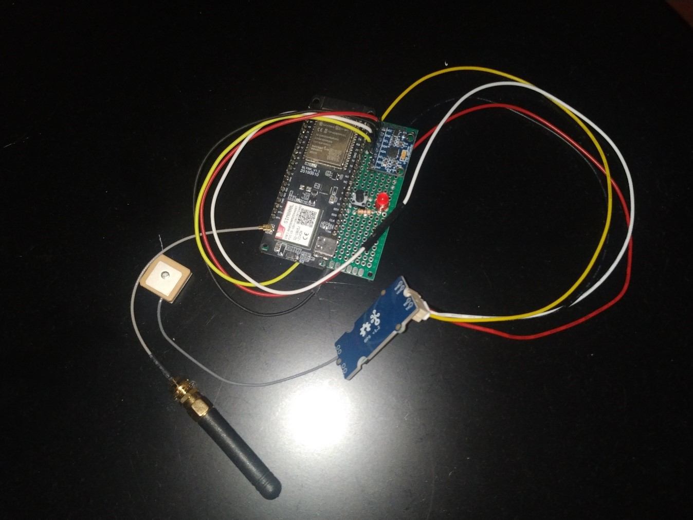

# Code for AmpShield device - ESP32 TTGO T-Call SIM900L

Part of the AmpShield  project. Application repository only on demand.
Webpage, videos and more explanation coming soon...

A device that monitors the condition of the vehicle with certain sensors (locked, unlocked, shaken, stolen) and in the event of a change in the condition, the device sends a notification and data to the application.

